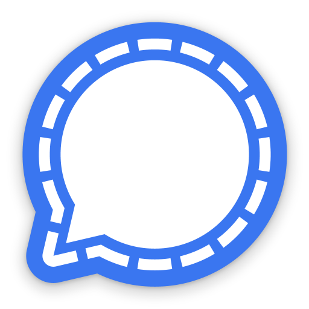
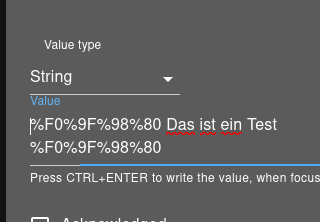

# ioBroker.signal-cmb

[](https://www.npmjs.com/package/iobroker.signal-cmb)
[](https://www.npmjs.com/package/iobroker.signal-cmb)

<!--[](https://david-dm.org/ioBroker/iobroker.signal-cmb)
[](https://snyk.io/test/github/ioBroker/ioBroker.signal-cmb)
-->
[](https://nodei.co/npm/iobroker.signal-cmb/)


<!--<**Tests:**: [](https://travis-ci.org/ioBroker/ioBroker.signal-cmb)
-->

**Tests**: [](https://github.com/necotec/ioBroker.signal-cmb/actions/workflows/test-and-release.yml)

## signal-cmb adapter for ioBroker
Big thanks to free [CallMeBot](https://www.callmebot.com/blog/free-api-signal-send-messages/) service, this adapter allows you to send Signal messages to yourself or other number.

**Note** : *The Free API is only for personal use!*

### Configuration
*Following documentation was copied from [callmebot](https://www.callmebot.com/blog/free-api-signal-send-messages/) page.*

You need to get the API key form the bot before using the API:

- Add the phone number of the CallMeBot into your Phone Contacts (Name it it as you wish). You can find the actual phone number here: https://www.callmebot.com/blog/free-api-signal-send-messages/ 
- Send this message `I allow callmebot to send me messages` (in english) to the new contact created (using Signal of course).
- Wait until you receive the message `API Activated for your phone number. Your APIKEY is 123123` from the bot. As this is still in beta testing, the activation can take up to 2 minutes.
- The Signal message from the bot will contain the API key needed to send messages using the API.
- You can now use the API KEY in the ioBroker configuration.

Example:


### Usage
There are two possibilities to send a messages:
- via `signal-cmb.0.sendMessage`. Just write some text into this state and the message will be sent to default number, that was configured in settings dialog.
- via message from javascript adapter:
```
sendTo('signal-cmb.0', 'send', {
    text: 'My message', 
    phone: '+491234567890' // optional, if empty the message will be sent to the default configured number
});
``` 


### Emojies
To send Emojies, you must add some **'Codes'** to your Message. You can find all available codes here: https://www.callmebot.com/uncategorized/list-of-urlencoded-unicode-emoticons-emojis/

### Available Emojies
The following Emojies are official supported from CallMeBot:
|Code|Emojie|
|---|---|
|%F0%9F%98%80||
|%F0%9F%98%83||
|%F0%9F%98%84||
|%F0%9F%98%81||
|%F0%9F%98%86||
|%F0%9F%98%85||
|%F0%9F%A4%A3||
|%F0%9F%A4%A3||
|%F0%9F%98%82||
|%F0%9F%99%82||
|%F0%9F%98%89||
|%F0%9F%98%8A||
|%F0%9F%98%87||

#### Use Emojies
To use an Emojie, you have to insert the code of the Emojie to your text, what you want to send.



The **signal-cmb** adapter URLencode this code and you see in your Signal Messenger on you phone the Emojie.


## Changelog
<!--
Placeholder for the next version (at the beginning of the line):
## **WORK IN PROGRESS**
* Did some changes
* Did some more changes
-->
### 0.2.3 (08.07.22)
* (derAlff) Added support for 'encoded newline' in string
* (derAlff) Updated README

### 0.2.2 (07.12.22)
* (derAlff) Version change for NPM

### 0.2.1 (07.12.22)
* (derAlff) Version change for NPM

### 0.2.0 (07.12.22)
* (derAlff) Added support for Emojies
* (derAlff) Added informations about emojies in README
* (derAlff) Replaced phone number in README/Configuration with link to actual phone number on CallMeBot website

### 0.1.7 (16.02.22)
* (derAlff) Version change for NPM

### 0.1.6 (2022-01-22)
* (derAlff) Released on npm
* (derAlff) Updated README.md
* (derAlff) Translated desc in io-package.json
* (derAlff) Changed connectionType to cloud
* (derAlff) Changed native part

### 0.1.5 (2022-01-22)
* (derAlff) Fixed Blockly issue

### 0.1.4 (2022-01-22)
* (derAlff) Updated io-package.json and package.json. 
* (derAlff) Added "messagebox": true to io-package.json. 
* (derAlff) Changed phonenumber in admin page.

### 0.1.3 (2022-01-21)
* (derAlff) Updated README.md, io-package.json and package.json

### 0.1.0
* (derAlff) Release tested and running version 0.1.0

### 0.0.1 (2022-01-21)
* (derAlff) Initial release.

## ToDo
* Add a Phonebook
* Add multiple users (phone numbers and API-Keys) 

## License
MIT License

Copyright (c) 2022 derAlff <derAlff@gmail.com>

Permission is hereby granted, free of charge, to any person obtaining a copy
of this software and associated documentation files (the "Software"), to deal
in the Software without restriction, including without limitation the rights
to use, copy, modify, merge, publish, distribute, sublicense, and/or sell
copies of the Software, and to permit persons to whom the Software is
furnished to do so, subject to the following conditions:

The above copyright notice and this permission notice shall be included in all
copies or substantial portions of the Software.

THE SOFTWARE IS PROVIDED "AS IS", WITHOUT WARRANTY OF ANY KIND, EXPRESS OR
IMPLIED, INCLUDING BUT NOT LIMITED TO THE WARRANTIES OF MERCHANTABILITY,
FITNESS FOR A PARTICULAR PURPOSE AND NONINFRINGEMENT. IN NO EVENT SHALL THE
AUTHORS OR COPYRIGHT HOLDERS BE LIABLE FOR ANY CLAIM, DAMAGES OR OTHER
LIABILITY, WHETHER IN AN ACTION OF CONTRACT, TORT OR OTHERWISE, ARISING FROM,
OUT OF OR IN CONNECTION WITH THE SOFTWARE OR THE USE OR OTHER DEALINGS IN THE
SOFTWARE.
